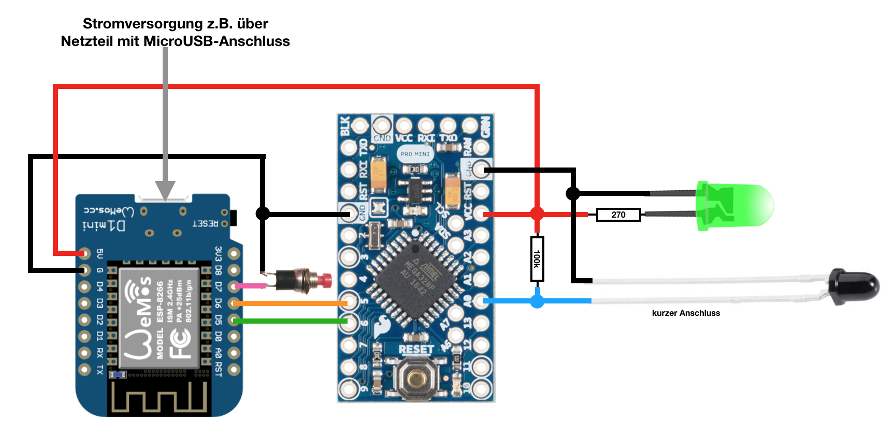
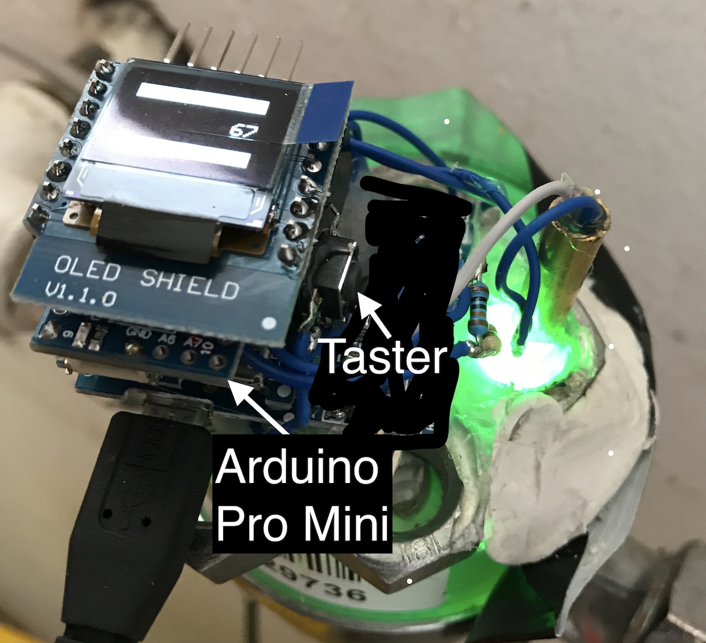

# Erfassung des Wasserverbrauchs in HomeMatic

Angelehnt an das Projekt auf [stall.biz](https://www.stall.biz/project/impulsgeber-fuer-den-wasserzaehler-selbst-gebaut) geht
es hier um die Integration eines solchen Impulsgebers in HomeMatic. Folgt man dem Link, kann man sich Ideen holen, wie man die optische Erfassungseinheit - also die LED 
und den Phototransistor am besten an seinem Zähler positioniert.

Entgegen der Umsetzung auf stall.biz, verzichte ich auf den TCRT5000 als Impulsgeber, denn man kann an diesem keine Hysterese einstellen, so dass es bei meinen Versuchen immer wieder zu einem "Flapping" (Flattern) kam, wenn der 
Zeiger des Wasserzähles an der Stelle zum Stehen kam, als er gerade soweit den Phototransistor abgedunkelt hat, dass er immer wieder den TCRT5000 zum Schalten brachte.
Dadurch kam es zu ungewollten Impulsen und Zählvorgängen.

## Folgende Bauteile werden benötigt:
- Wemos D1 Mini
- Wemos D1 OLED Shield
- Arduino Pro Mini (ATtiny85-Unterstützung ist in Arbeit - wird umgesetzt, sobald die Lieferung da ist)
  - +FTDI Adapter zum Programmieren des Arduino Pro Mini
- stabiles! 5V Netzteil
- 1 Taster
- 1 LED 3mm grün, klar, mit sehr hoher Helligkeit (je heller desto besser, ich verwende 12.000mcd)
- 1 Phototransistor SFH 309-5 (klar oder schwarz)
- 1 Widerstand 270Ohm
- 1 Widerstand 100kOhm

## elektronischer Aufbau

#### Schaltplan

#### Das OLED-Display wird einfach "huckepack" mit dem Wemos D1 mini verbunden und verlötet.

#### Zusammengebaut (von unten nach oben): Wemos D1 mini - Arduino Pro Mini - OLED Display
